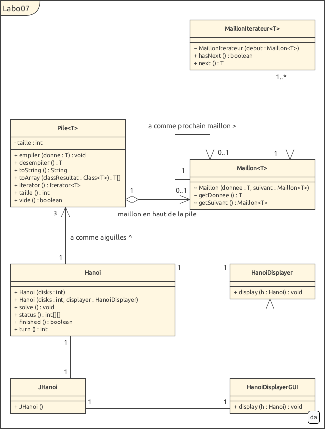
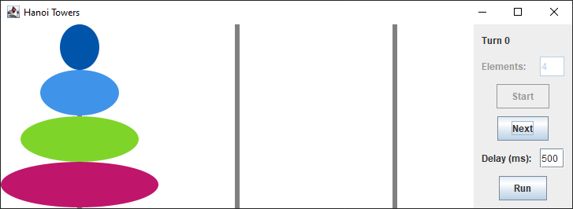
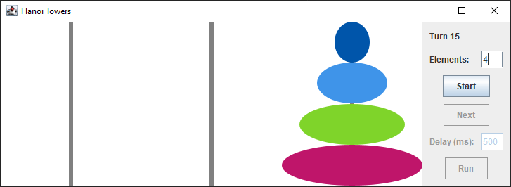

# Labo 7 - Rapport

Auteurs : Kevin Ferati & Romain Humair

## Moines surentraînés
Le nombre de déplacements est de l'ordre de 2^n-1 ou n représente le nombre de disques
~~~
    1 disque  : 2^1-1  = 1 opération
    2 disques : 2^2-1  = 3 opérations
    4 disques : 2^4-1  = 15 opérations
    ...
    64 disques: 2^64-1 = 18446744073709551615 opérations
~~~
Si les moines déplacent 1 disque par seconde, la résolution du jeu des tours de Hanoi va prendre 18446744073709551615 
secondes soit 584.94 milliards d'années.

Selon la légende, une fois la tour de Hanoi reconstruite sur une autre aiguille, l'univers disparaîtra.
En considérant que les moines ont commencé à reconstruire la tour de Hanoi à la naissance de l'univers et que
celui-ci est âgé de 13.7 milliards d'années, il nous reste (584.94-13.7) 571.24 années avant que l'univers
ne s'effondre.

___
## UML
  
fichier png en annexe

___
## Pile

La classe Pile est générique sur T. Ainsi, elle peut fonctionner avec théoriquement n'importe quel type.

Cette implémentation d'une pile est séparée en 3 classes :

Pile\<T> qui est l'unique classe publique et est le point d'entrée de la pile et dont la structure linéaire est 
une liste simplement enchaînée permettant d'ajouter des sommets en complexité O(1),

Maillon\<T> qui représente une chaîne dans une liste,
et MaillonIterateur\<T> permettant d'itérer sur une liste simplement enchaînée.

Elle contient un attribut "taille" privée permettant de créer plus facilement un tableau et permettant une méthode 
taille() retournant la taille de la pile.
___
####  Cas de la fonction toArray()
C'était le premier problème rencontré. On ne voulait pas passer par une fonction rendant un tableau Objet[] afin de 
garder un typage sur T, sauf qu'il n'est pas possible de créer un tableau de type T[]

Ainsi, la fonction toArray de la Pile prend en paramètre une instance de type Class\<T> (de même type que l'argument 
générique de Pile) permettant ainsi d'obtenir comme résultat un tableau typé (et pas de type Object[]).
___
### Tests Pile

Les tests de la pile sont réalisés au moyen de la classe PileTest, une classe de test unitaire JUnit 5.

Les tests sont les suivants :

- Fonction empiler 
- Fonction desempiler 
- Fonction desempiler sur une pile vide
- Boucle foreach 
- Fonction de conversion en array 
- Fonction de conversion en string 

Chacun de ces tests fonctionne. Il n'y a pas eu de problème particulier à la réalisation de la pile.
Voir le fichier PileTest.java pour plus de détails sur les tests.
___
## Hanoi
La classe Hanoi implémente toutes les méthodes demandées et nécessaires à la résolution du 
jeu des Tours de Hanoi.

Il y a deux constructeurs, un pour l'affichage sur console et 
un générique pour l'affichage graphique et qui est utilisé par JHanoi.

La méthode solve() permet de résoudre le jeu. Elle utilise un algorithme de résolution récursif.

---
### Tests Hanoi

Les tests de la classe Hanoi sont réalisés en donnant différentes valeurs en argument à la classe HanoiTest.

`> java HanoiTest Test
~~~
java.lang.NumberFormatException: For input string: "Test"
~~~

`> java HanoiTest -5
~~~
java.lang.IllegalArgumentException: Il ne peut pas y avoir 0 ou moins de disque
~~~

`> java HanoiTest 0
~~~
java.lang.IllegalArgumentException: Il ne peut pas y avoir 0 ou moins de disque
~~~

`> java HanoiTest 5 6
~~~
java.lang.RuntimeException: Un argument maximum
~~~

`> java HanoiTest 1.5
~~~
java.lang.NumberFormatException: For input string: "1.5"
~~~

`> java HanoiTest 1
~~~
-- Turn : 0
One   : [1]
Two   : []
Three : []

-- Turn : 1
One   : []
Two   : []
Three : [1]
~~~

`> java HanoiTest 4
~~~
-- Turn : 0
One   : [1, 2, 3, 4]
Two   : []
Three : []

-- Turn : 1
One   : [2, 3, 4]
Two   : [1]
Three : []

...

-- Turn : 15
One   : []
Two   : []
Three : [1, 2, 3, 4]
~~~

`> java HanoiTest  
(pas d'argument)

La classe Hanoi fonctionne, le jeu des tours de Hanoi est bien résolu et la sélection de l'affichage 
console/graphique est sélectionné en fonction de s'il y a un argument ou non.

___

## Problèmes à la compilation
Il a été compliqué de faire compiler ce programme pour afficher le GUI, mais la solution retenue est :
1. En CLI, naviguer dans le dossier src
2. lancer la compilation avec javac .\HanoiTest.java
3. Lancer l'exécution avec java HanoiTest

On a essayé de mettre le fichier HanoiTest.java dans le package test, sans résultat.

## Autres problèmes
Outre la réalisation de la fonction toArray et la compilation, il n'y a pas eu de problème à la résolution de ce labo.

